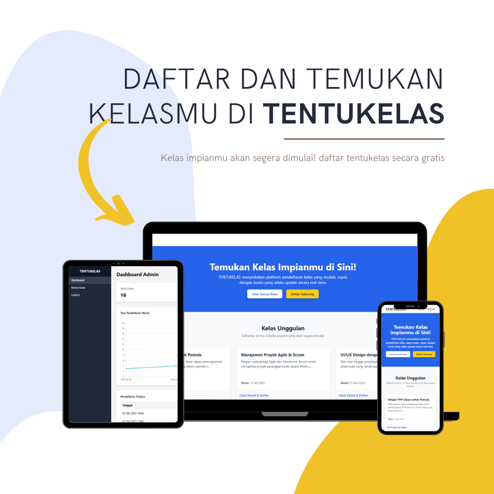

# Proyek: TENTUKELAS - Sistem Pendaftaran Kelas Real-time


TENTUKELAS adalah aplikasi web yang memungkinkan siswa untuk melihat daftar kelas yang tersedia, melihat sisa kuota secara real-time, dan mendaftarkan diri. Administrator dapat mengelola (membuat, membaca, mengupdate, menghapus) data kelas dan melihat daftar peserta.

## Tampilan Aplikasi



- **Untuk Siswa:**
  - Registrasi & Login Akun
  - Melihat daftar kelas yang tersedia beserta sisa kuota.
  - Mendaftar ke kelas.
  - Melihat riwayat kelas yang sudah diikuti ("Kelas Saya").
- **Untuk Admin:**
  - Login & Dashboard Statistik.
  - Grafik analitik untuk popularitas kelas dan tren pendaftaran.
  - Manajemen Kelas (CRUD - Create, Read, Update, Delete).

## Teknologi

- **Backend:** PHP (Native/Vanilla)
- **Frontend:** HTML, Tailwind CSS (via CDN), JavaScript (untuk grafik menggunakan chart.js)
- **Database:** MySQL
- **Manajemen Dependensi PHP:** Composer
- **Testing:** PHPUnit

## Arsitektur & ERD

Aplikasi ini menggunakan pola arsitektur **Model-View-Controller (MVC)** yang disederhanakan untuk memisahkan logika, data, dan tampilan.

```mermaiderDiagram
    ROLES { int id PK; varchar role_name; }
    USERS { int id PK; varchar name; varchar email UK; varchar password; int role_id FK; }
    CLASSES { int id PK; varchar class_name; text description; int quota; datetime start_date; }
    REGISTRATIONS { int id PK; int user_id FK; int class_id FK; timestamp registration_date; }
    USERS ||--o{ ROLES : "has"; REGISTRATIONS }o--|| USERS : "makes"; REGISTRATIONS }o--|| CLASSES : "receives"
```

## Panduan Instalasi (Lokal)

Prasyarat: XAMPP (dengan PHP 8+, MySQL), Composer, Git.

1. Clone repositori ini: git clone https://github.com/wonderkid99/tentukELAS.git

2. Pindahkan folder tentukelas ke dalam htdocs XAMPP Anda.

3. Jalankan composer install di direktori proyek untuk menginstal dependensi.

4. Buat database baru di phpMyAdmin bernama db_tentukelas.

5. Impor file database/schema.sql ke database yang baru dibuat.

6. Buat user admin secara manual di tabel users dengan role_id = 1.

7. Akses proyek melalui http://localhost/tentukelas/public/.

## 1. Hasil Unit Testing

Pengujian unit dilakukan pada komponen-komponen kritis di level Model untuk memastikan logika pemrosesan data berjalan dengan benar.

- **Framework:** PHPUnit 10.0
- **Perintah Eksekusi:** `./vendor/bin/phpunit`
- **Hasil:**
  Time: 00:00.081, Memory: 8.00 MB

OK (1 test, 4 assertions)

- **Kesimpulan:** **LULUS**. Semua unit test yang didefinisikan untuk `ClassModel` berhasil dijalankan tanpa error atau peringatan.

---

## 2. Hasil End-to-End (E2E) Testing Manual

Pengujian E2E dilakukan dengan mensimulasikan alur kerja pengguna secara lengkap dari awal hingga akhir.

| Skenario Pengujian              | Langkah-langkah                                                                                     | Hasil yang Diharapkan                                                              | Status   | Catatan |
| :------------------------------ | :-------------------------------------------------------------------------------------------------- | :--------------------------------------------------------------------------------- | :------- | :------ |
| **Admin: Login & Kelola Kelas** | 1. Login sebagai admin. 2. Buka "Kelola Kelas". 3. Tambah, Edit, dan Hapus kelas.                   | Admin berhasil login dan melakukan semua operasi CRUD pada kelas tanpa error.      | **Pass** | -       |
| **Siswa: Registrasi & Daftar**  | 1. Register akun baru. 2. Login. 3. Buka dashboard, daftar ke 1 kelas. 4. Buka "Kelas Saya".        | Semua alur berjalan lancar. Pendaftaran berhasil dan kelas muncul di "Kelas Saya". | **Pass** | -       |
| **Validasi: Kuota Penuh**       | 1. Set kuota kelas A menjadi 1. 2. Siswa 1 mendaftar kelas A. 3. Siswa 2 mencoba mendaftar kelas A. | Siswa 2 melihat tombol "Penuh" dan tidak bisa mendaftar.                           | **Pass** | -       |
| **Validasi: Daftar Ganda**      | 1. Siswa 1 mendaftar kelas B. 2. Mencoba mendaftar lagi ke kelas B.                                 | Tombol untuk kelas B berubah menjadi "Sudah Terdaftar" dan tidak bisa diklik.      | **Pass** | -       |
| **Validasi: Akses Ilegal**      | 1. Siswa mencoba akses URL dashboard admin. 2. User non-login mencoba akses dashboard siswa.        | Siswa mendapat pesan "Akses Ditolak". User non-login diarahkan ke halaman login.   | **Pass** | -       |

- **Kesimpulan:** **LULUS**. Semua skenario utama pengguna dan validasi penting berjalan sesuai dengan fungsionalitas yang diharapkan.

---
